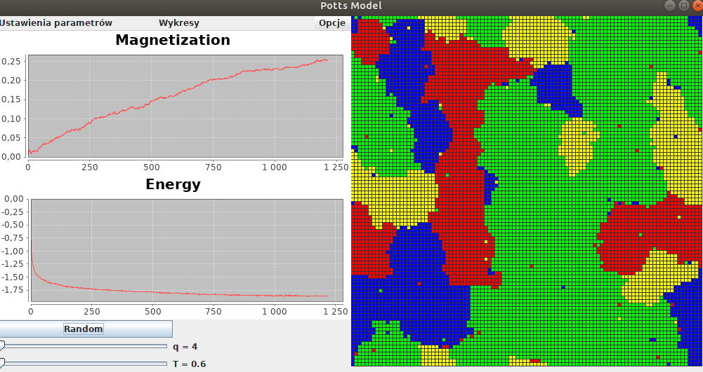
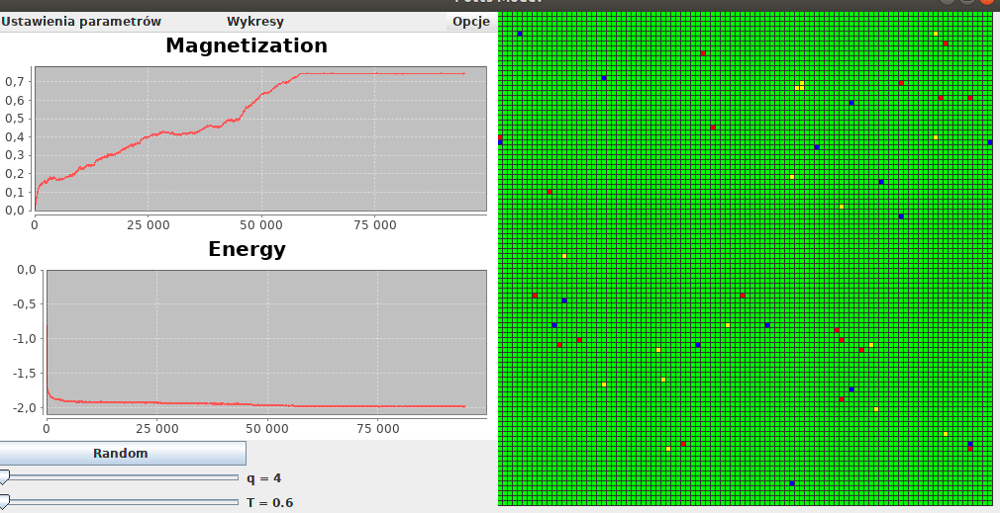

# PottsModel
Java project made with colleague that show symulation of  Potts model 

The Potts model is an example of an agent model that is used for example to describe opinions in society. 
In this model, each of the agents (nodes) is assigned one of several available states. 
These nodes form a net and during dynamics can change their state as a result of interaction with neighbors 

In this program it was possible to change the system temperature and the number of states for a given network of nodes. 
For better visualization, each state has been assigned a different color. 
The view from the program is shown below.  
View from the simulation for q = 4 and T = 0 :

  
View from the simulation for q = 4 and T = 0 after some time:

  
On the right side we see a network of nodes represented by colored squares. 
On the left while there is a panel where you can set the number of states and temperature.
There also displays graphs for magnetization and energy on an ongoing basis. 
Additionally, during the simulation the program saves to the text file results for energy,
magnetization and the number of active links.
